# Manual do Utilizador

## O que faz esta Ferramenta

Esta plataforma ajuda a analisar se os transformadores da rede elétrica (chamados **PTDs**) conseguem suportar a adição de carregadores para veículos elétricos. Pense nela como um "teste de stress" para a rede elétrica: diz-lhe **quão arriscado** seria instalar carregadores de VE numa área específica, e **quantos carregadores** a rede consegue suportar em segurança.

A plataforma tem **três ferramentas principais**, cada uma com a sua própria página:

| Ferramenta | O que Faz |
|------------|-----------|
| **Previsão** | Faz uma previsão única para um transformador específico |
| **Simulação** | Testa cenários de "e se..." adicionando ruído aleatório para ver como o modelo se comporta |
| **Análise Regional** | Analisa **todos os transformadores** num distrito ou concelho de uma só vez |

---

## Conceitos-Chave

Antes de usar a ferramenta, eis alguns termos que vai encontrar:

| Termo | O que Significa |
|-------|-----------------|
| **PTD** | Um transformador elétrico específico da rede. Cada um tem um código (como `PTD-12345`) e uma localização. |
| **Perfil** | Uma configuração pré-definida: `leve` (ligeiro), `regular` (médio), ou `pesado` (pesado). Isto indica ao sistema quão agressivamente deve analisar. |
| **Modelo** | O "cérebro" que faz as previsões. As opções incluem NeuralNet, Decision Tree, SVM, etc. Os marcados como **Recomendado** costumam funcionar melhor. |
| **Classificação** | O nível de risco: **Baixo** (seguro), **Médio** (cuidado), ou **Alto** (sobrecarga perigosa). |
| **Regressão** | Uma previsão numérica, nomeadamente, quanta potência (em kW) a rede vai precisar de suportar. |
| **Potência Instalada** | A potência máxima que o transformador foi construído para suportar (em kVA). |
| **Potência do Carregador** | Quanta potência um carregador de VE utiliza (em kW). |
| **Fator de Utilização** | Quanto tempo os carregadores estão efetivamente a ser utilizados (0 a 1). Por exemplo, 0,7 significa que os carregadores estão em uso 70% do tempo. |
| **Carga Total dos Carregadores** | A procura de potência real de todos os carregadores combinados = `Número de Carregadores × Potência por Carregador × Fator de Utilização`. |

---

## Página 1: Previsão

Utilize esta página quando quiser analisar **um transformador específico** e ver se consegue suportar carregadores de VE.

### Guia Passo a Passo

#### 1. Configuração (Secção Superior)
- **Perfil**: Escolha `leve`, `regular`, ou `pesado`. Isto afeta a rigorosidade da análise.
- **Versão** (opcional): Deixe em branco a menos que tenha uma versão específica do modelo para testar.
- **Modelo**: Escolha um modelo de previsão. Os que têm a etiqueta verde **Recomendado** costumam dar os melhores resultados.

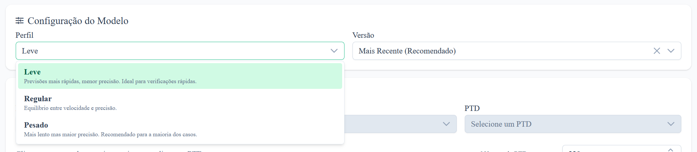

#### 2. Selecionar uma Localização (Seleção de PTD)
- Utilize o **mapa e o seletor** para encontrar o seu transformador.
- Quando seleciona um PTD, o sistema preenche automaticamente todos os detalhes técnicos desse transformador (potência instalada, número de luminárias, etc.).
- Os valores **Distrito_enc** e **Concelho_enc** atualizam-se automaticamente com base na sua seleção.

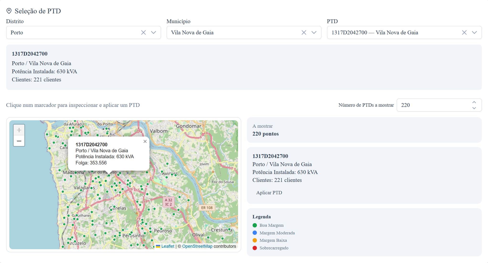

#### 3. Escolher a Tarefa (Separadores)

**Separador A: Classificação** — "Este transformador vai sobrecarregar?"
- O sistema prevê se o risco é **Baixo**, **Médio**, ou **Alto**.
- Após clicar em **Submeter**, verá:
  - Uma **etiqueta de risco com código de cor** (verde = seguro, laranja = cuidado, vermelho = perigo)
  - Um **medidor de confiança** a mostrar a certeza do modelo
  - **Scores brutos** a mostrar a probabilidade para cada nível de risco

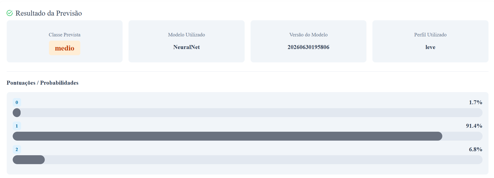

**Separador B: Regressão** — "Quanta potência vai ser necessária?"
- O sistema prevê a **procura de potência exata** em kW.
- Também pode configurar a **simulação de carregadores**:
  - Escolha um **modelo de carregador** no dropdown (isto preenche automaticamente a potência)
  - Defina **quantos carregadores** quer instalar
  - Defina o **fator de utilização** (quanto ocupados os carregadores vão estar)

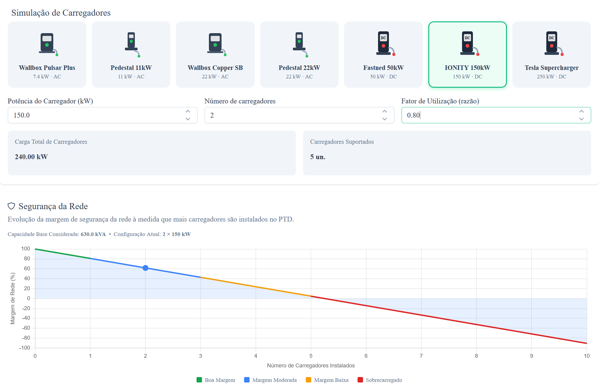

- Verá:
  - O **valor de potência previsto** em kW
  - **Carga total dos carregadores** e **número de carregadores suportados**
  - Um **Gráfico de Segurança da Rede** a mostrar se o seu plano é seguro

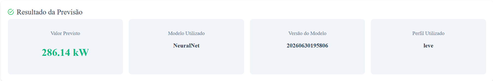

#### 4. Rever Resultados
Os resultados aparecem abaixo do formulário. O sistema faz scroll automaticamente até eles. Cada previsão é guardada no seu histórico.

---

## Página 2: Simulação

Utilize esta página para executar **experiências de "e se..."**. Em vez de uma previsão única, o sistema executa **centenas ou milhares** de previsões com dados ligeiramente aleatorizados para ver quão estáveis são os resultados.

### Guia Passo a Passo

#### 1. Configuração
- Defina o **Perfil**, **Versão**, e **Modelo** tal como na Previsão.

#### 2. Selecionar um PTD
- Escolha um transformador. Os valores codificados (Distrito_enc, Concelho_enc, N_Clientes) aparecem automaticamente.

#### 3. Escolher um Cenário
- Clique num dos três cartões para definir o **nível de risco alvo** que quer testar:
  - **Risco Baixo**: Testar se o sistema diz consistentemente "seguro"
  - **Risco Médio**: Testar casos limite
  - **Risco Alto**: Testar se o sistema deteta situações perigosas

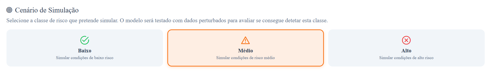

#### 4. Definir Parâmetros
- **Iterações**: Quantos testes aleatórios executar (100 a 100.000). Mais = mais preciso, mas mais lento.
- **Escala de Ruído**: Quanta aleatoriedade adicionar (0,01 a valores mais altos). Mais alto = mais variação nos dados de teste.
- **Semente**: Um número que torna a aleatoriedade repetível. Use a mesma semente para obter os mesmos resultados "aleatórios".

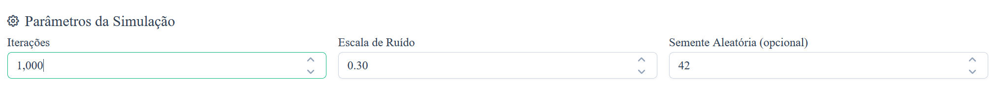

#### 5. Rever Resultados
Após clicar em **Executar Cenário**, verá:

| Resultado | O que Significa |
|-----------|-----------------|
| **Medidor de Taxa de Deteção** | Com que frequência o modelo identificou corretamente o cenário escolhido |
| **Gráfico Circular de Distribuição** | A divisão de resultados Baixo/Médio/Alto ao longo de todas as iterações |
| **Probabilidade de Sobrecarga** | A probabilidade de a rede realmente sobrecarregar |
| **Estatísticas de Resumo** | Média, desvio padrão, probabilidades mín/máx |
| **Detalhe de Deteção** | Um gráfico de barras a mostrar com que frequência cada nível de risco foi detetado |

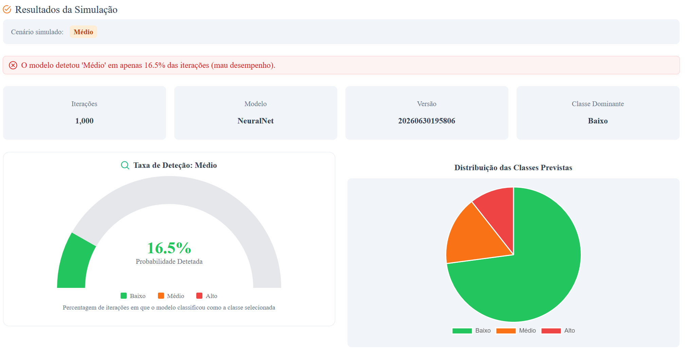
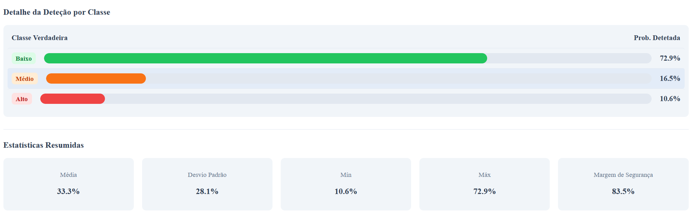

**A Ler a Faixa de Deteção:**
- **Verde** (≥70%): O modelo deteta fiavelmente este cenário
- **Laranja** (30-70%): O modelo está incerto
- **Vermelho** (<30%): O modelo tem dificuldade em detetar este cenário

---

## Página 3: Análise Regional

Utilize esta página para analisar **todos os transformadores num distrito ou concelho inteiro** de uma só vez. É ideal para planear implementações de carregadores de VE em grande escala.

### Guia Passo a Passo

#### 1. Configuração
- Defina o **Perfil**, **Versão**, e **Modelo** (nesta página, utiliza **modelos de regressão**).

#### 2. Selecionar uma Região
- **Distrito**: Escolha um distrito (por exemplo, "Lisboa", "Porto").
- **Concelho**: Escolha um concelho específico dentro desse distrito, ou deixe em branco para analisar o distrito todo.
- O sistema mostra quantos **PTDs** (transformadores) foram encontrados na sua seleção.

#### 3. Configurar Carregadores
- Escolha um **modelo de carregador** (preenche automaticamente a potência)
- Defina o **número de carregadores** por transformador
- Defina o **fator de utilização**
- O sistema mostra:
  - **Carga Total dos Carregadores** — procura de potência de todos os carregadores
  - **Carga por PTD** — quanto cada transformador deve suportar

#### 4. Executar Análise
- Clique em **"Analisar X PTDs"** para começar.
- Uma **barra de progresso** mostra quantos transformadores já foram analisados.
- O sistema processa em lotes de 10 para evitar sobrecarga.

#### 5. Rever Resultados

**Cartão de Resumo:**
- Total de PTDs analisados
- Contagem de transformadores de risco **Baixo**, **Médio**, e **Alto**
- **Carga prevista média** em todos os transformadores
- Um **gráfico circular** a mostrar a distribuição de risco

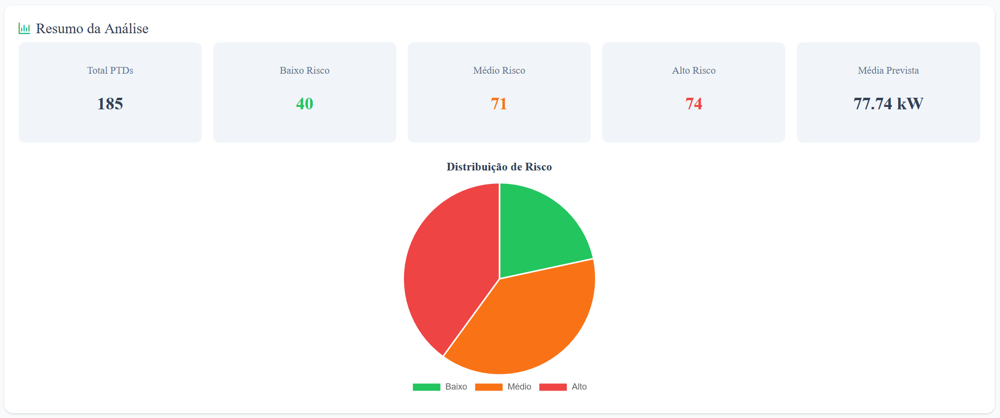

**Mapa:**
- Cada transformador aparece como um ponto colorido no mapa:
  - Verde = Risco baixo
  - Laranja = Risco médio
  - Vermelho = Risco alto
- **Clique em qualquer ponto** para ver informação detalhada sobre esse transformador
- O mapa faz zoom automaticamente para ajustar a todos os resultados

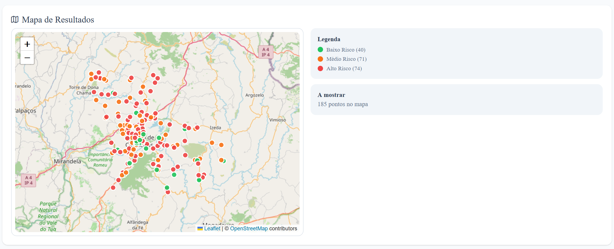

**Tabela de Resultados Detalhados:**
- Tabela ordenável e filtrável com todos os transformadores
- As colunas incluem:
  - Código PTD
  - Distrito / Concelho
  - Carga Prevista (kW)
  - Potência Instalada (kVA)
  - **Carga Total** (a vermelho se exceder a capacidade!)
  - **Margem** (margem de segurança, a vermelho se negativa)
  - **Classificação de Risco** (etiqueta com código de cor)
  - **Carregadores Suportados** (quantos carregadores este transformador consegue realmente suportar)
- Use **Limpar Filtros** para repor, ou **Exportar CSV** para descarregar os dados

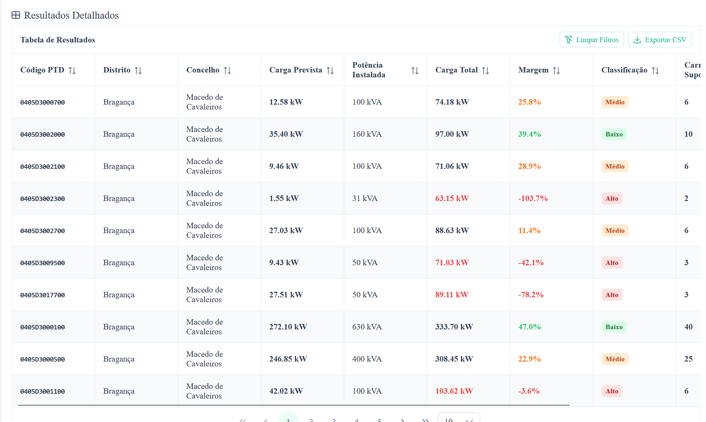

---

## Dicas para Melhores Resultados

| Dica | Porque Ajuda |
|------|--------------|
| Comece com os **modelos Recomendados** | Já foram pré-testados para precisão |
| Use **iterações baixas** (100-500) para testes rápidos, **iterações altas** (5000+) para relatórios finais | Equilibra velocidade vs. precisão |
| Verifique sempre a **margem** na Análise Regional | Margem negativa = sobrecarga = perigo |
| Compare os resultados de **classificação** e **regressão** | A classificação dá o nível de risco; a regressão dá números exatos |
| Use a **mesma semente** na Simulação para comparar diferentes configurações | Mantém a aleatoriedade consistente |
| Se um PTD mostrar **Risco Alto**, reduza os carregadores ou escolha um transformador mais potente | Segurança primeiro! |

---

## Compreender os Níveis de Risco

| Nível | Cor | Significado | Ação |
|-------|-----|-------------|------|
| **Baixo** | Verde | Seguro instalar carregadores | Avance com confiança |
| **Médio** | Laranja | Pode sobrecarregar em uso intenso | Monitore de perto; considere menos carregadores |
| **Alto** | Vermelho | Perigoso e provável de sobrecarregar | Não instale; atualize primeiro o transformador |

---

## Exportar os Seus Dados

Na página **Análise Regional**, clique em **Exportar CSV** para descarregar uma folha de cálculo com todos os resultados. O nome do ficheiro inclui o distrito e a data (por exemplo, `regional_analysis_Lisboa_2026-07-07.csv`). Abra-o no Excel ou Google Sheets para análise adicional.