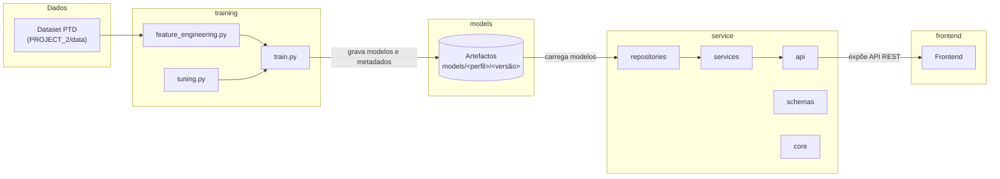
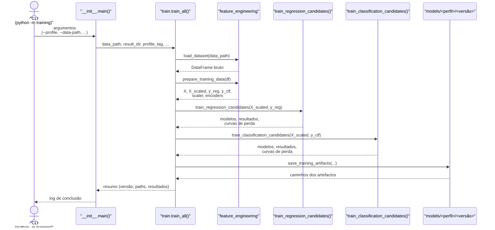
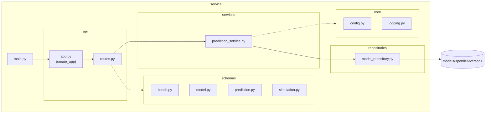

# Arquitectura global

Documentação da arquitectura da solução

A solução está organizada em quatro componentes principais, isolados em pastas próprias e com ciclos de vida independentes: o **pipeline de treino** (`/training`), que produz modelos a partir do dataset de Postos de Transformação de Distribuição (PTD); a **camada de serviço** (`/service`), que expõe esses modelos através de uma API; a **persistência de modelos** (`/models`), onde ficam os artefactos versionados; e o **frontend** (`/frontend`), que consume a API.

Cada componente é executável de forma independente (via `make` na sua própria pasta) ou orquestrado a partir do `Makefile` na raiz do repositório, que apenas delega para os `Makefile`s locais.



## `/training`

Pipeline responsável por treinar e avaliar os modelos de regressão e classificação que estimam a capacidade/utilização dos PTD. É um pacote Python autónomo, invocável com `python -m training` (ou `make train-leve` / `make train-regular` / `make train-pesado`), parametrizado por **perfis** (`leve`, `regular`, `pesado`) que controlam o esforço computacional do treino — dimensão das amostras usadas em validação cruzada, profundidade das árvores, configurações de redes neuronais, etc.

#### `train.py`

Orquestra o treino de ponta a ponta: carrega o dataset, prepara as features (via `feature_engineering.py`), treina os candidatos de cada família de modelo (Regressão Linear, Árvore, SVM, Rede Neuronal para regressão; Árvore de Decisão, Rede Neuronal, SVM e KNN para classificação) com validação cruzada (`KFold`), selecciona o melhor candidato por família com base nas métricas obtidas, reajusta os modelos finais ao dataset completo, e grava os artefactos (modelos, *scaler*, *encoders*, métricas e curvas de perda) em `models/<perfil>/<versão>/`.



#### `tuning.py`

Define a configuração de treino (`CFG`) através de uma base comum (`BASE_CFG`) sobreposta pelo perfil escolhido, carregado a partir de `profiles/<perfil>.json`. Esta configuração governa, entre outros parâmetros: o número de *folds* na validação cruzada, a dimensão das amostras usadas para acelerar a validação cruzada (`sample_cv`) e o cálculo das curvas de perda (`sample_loss`), as grelhas de hiperparâmetros candidatos para SVM e Redes Neuronais, e os critérios de paragem antecipada das Redes Neuronais.

### `feature_engineering.py`

Responsável pela preparação dos dados antes do treino: remoção de colunas não preditivas ou redundantes, construção do alvo de classificação `utilizRede` (categorias *baixo* / *médio* / *alto*, derivadas de `Util_Decimal` por *thresholds* configuráveis), codificação ordinal de `Distrito` e `Concelho`, selecção das colunas numéricas relevantes como *features*, e normalização (`StandardScaler`) para os modelos sensíveis à escala (SVM, KNN, Redes Neuronais).

**Principais colunas de features (perfil `leve`):**

| Feature | Descrição |
|---------|-----------|
| `Potência instalada [kVA]` | Potência instalada do PTD |
| `P_IP_Total` | Potência total de iluminação pública |
| `P_IP_Inef` | Potência de iluminação pública ineficiente |
| `LED_Ratio` | Rácio de luminárias LED |
| `N_Luminarias` | Número de luminárias |
| `N_Lampadas` | Número de lâmpadas |
| `Cap_per_Cliente` | Capacidade por cliente |
| `Distrito_enc` | Distrito codificado (ordinal) |
| `Concelho_enc` | Concelho codificado (ordinal) |
| `N_Clientes` | Número de clientes |

## `/service`

Backend e API da aplicação. Expõe os modelos treinados (persistidos em `/models`) através de uma API REST, organizada em camadas: `api` (rotas e composição da aplicação FastAPI), `schemas` (contratos de entrada/saída, validados com Pydantic), `services` (lógica de negócio — preparação de *inputs*, invocação dos modelos, interpretação de resultados) e `repositories` (acesso aos artefactos persistidos em `/models`). A configuração e o *logging* transversais ficam isolados em `core`.

É executável de forma independente com `make serve` (modo de desenvolvimento, com *autoreload*) ou `make serve-prod`, ambos a partir da raiz ou da própria pasta `/service`.

### Endpoints da API

A API é servida em `http://localhost:8000/api/v1`. A documentação interativa (Swagger UI) está disponível em `/api/docs`.

| Método | Endpoint | Descrição |
|--------|----------|-----------|
| `GET` | `/health` | Verifica se o serviço está em execução |
| `GET` | `/ready` | Verifica se os artefactos dos modelos estão disponíveis |
| `POST` | `/predict` | Executa uma predição (regressão ou classificação) |
| `POST` | `/simulate` | Executa simulação Monte Carlo para estimar probabilidade de sobrecarga |
| `GET` | `/feature-importance` | Obtém a importância das features para um modelo específico |
| `POST` | `/reload` | Recarrega os artefactos dos modelos em memória |

### Arquitectura



## `/models`

Persistência dos modelos. Cada execução do treino gera uma versão imutável dos artefactos, organizada por perfil e *timestamp*:

```
models/<perfil>/<versão>/
├── models/
│   ├── <perfil>_model_lr.pkl          # Regressão Linear
│   ├── <perfil>_model_tree.pkl        # Árvore (regressão)
│   ├── <perfil>_model_svm.pkl         # SVM (regressão)
│   ├── <perfil>_model_nn.pkl          # Rede Neuronal (regressão)
│   ├── <perfil>_model_tree_clf.pkl    # Árvore de Decisão (classificação)
│   ├── <perfil>_model_svm_clf.pkl     # SVM (classificação)
│   ├── <perfil>_model_knn_clf.pkl     # KNN (classificação)
│   ├── <perfil>_model_nn_clf.pkl      # Rede Neuronal (classificação)
│   ├── <perfil>_scaler.pkl            # StandardScaler treinado
│   └── <perfil>_geo_mapping.pkl       # Mapeamento Distrito/Concelho ↔ código
└── metadata/
    ├── results.json                   # Métricas de regressão (CV)
    ├── results_clf.json               # Métricas de classificação (CV)
    ├── curves.json                    # Curvas de perda das Redes Neuronais
    ├── summary.json                   # Melhores hiperparâmetros por modelo
    └── config.json                    # Configuração (CFG) usada nesta execução
```

Esta versão imutável é a unidade de troca entre `/training` e `/service`: o `model_repository.py` lê directamente desta estrutura, pelo que qualquer execução de treino fica imediatamente disponível para a API, bastando apontar para a versão pretendida.

## `/frontend`

TBD.